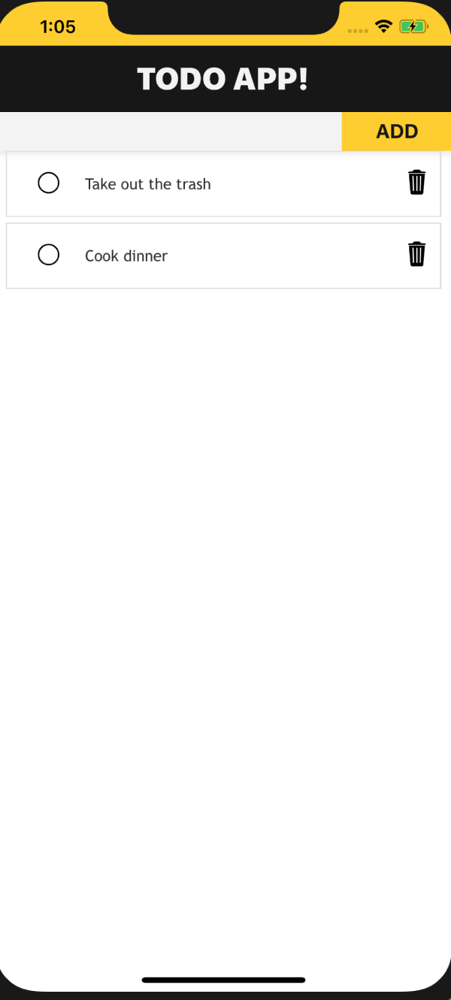
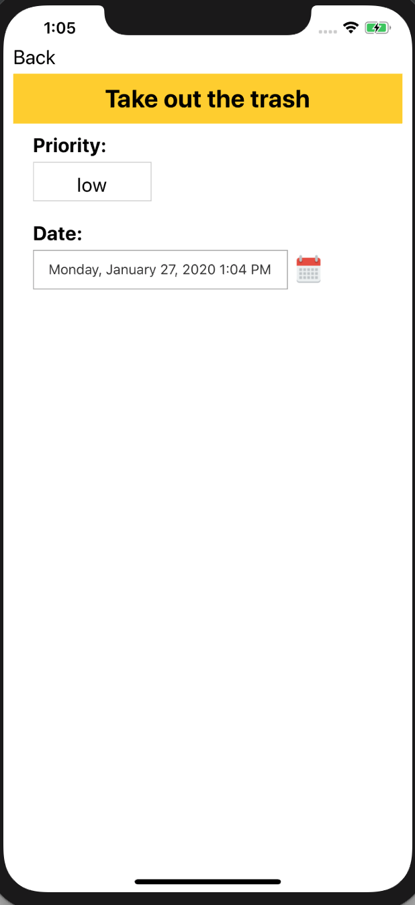

# Hack-A-Thing-2

### Bailey Burke and Avery Vanacore

### CS98 Winter 2020

## What We did

We built a react native app simulating an interactive "To-do List." Bailey had never used or worked with React Native before, whereas Avery was first exposesd to it in hack-a-thing-1, so Bailey spent the first half learning the ins and outs of react native and getting to know the basic syntax, etc. This was a refresher for Avery, who also enlightened Bailey with the knowledge she learned 2 weeks prior, when necessary. Then Bailey got the app up and running, and implemented basic functionality, such as adding an input bar, adding the header, getting expo and xcode simulator to run, and getting code from the user input to be pulled as text into a different component of the app. Avery was an onlooker for all of this, and took over after the basics were implemented to add more complex functionality, building upon what she previously learned.  The initial tutorial ended with a basic to-do list that allowed the user to add a new task, click an existing task to mark it as done, and delete an existing task.  Avery added some style, such as an icon to toggle whether or not the task is complete and another to delete the task.  She also added another component for the Todo detail, so that users can click on the todo and go to a detailed page with the priority and due date of the todo.  Users can update this information on this page, and this information is then stored with each task.

## What We learned

Essentially every platform used for this project was new to Bailey, so React Native was used a new experience. It helps that it is pretty similar to React, but overall the basic structure of React Native was learned, such as the native components. It was also a refresher of some basic React concepts, like JSX, components in general, and props/the state. She kind of enjoyed how the styles are written directly in the JavaScript files. She had also never used simulator before, so that was a new experience.  Since Avery had only worked with React Native once before, it was good practice to get more comfortable with its syntax/structure. 

## What didn't work for us

What was initially challenging was just conceptualizing and remembering how React Native differs from React. The setup also provided some challenges. In the beginning, some of the code based on the tutorial threw an error, so had to be changed slightly. That took a bit of time to figure out.  Specifically for Avery, it was challenging to take the code and knowledge she had from following a previous tutorial and apply it to this application.  Since her hack-a-thing-1 app also involved clicking on an element and getting to a more detailed page, she was expecting it to be relatively simple to implement that feature in this to-do app; however, the differences in the basic structure/functionality of each app made it relatively tricky.  She also thought it was challenging to figure out how to allow the user to update specific data about a task on its detail page and make sure it holds, so that the user can return to the main page then later click back to the task and see the updated information.

## Tutorials

- https://www.youtube.com/watch?v=NuZOwsmzcro

- http://facebook.github.io/react-native/docs/getting-started

- https://www.linkedin.com/learning/react-native-essential-training/welcome?u=2167153

## Pics

